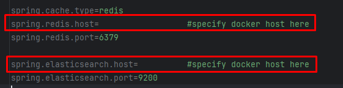
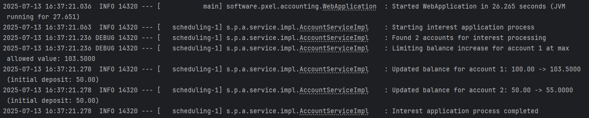
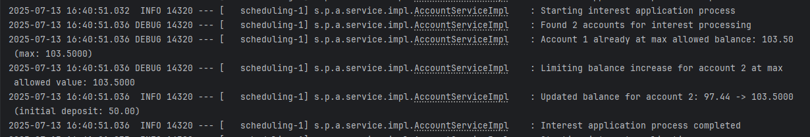
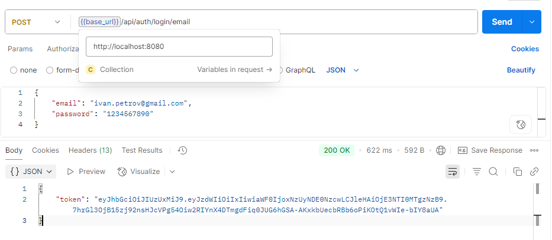
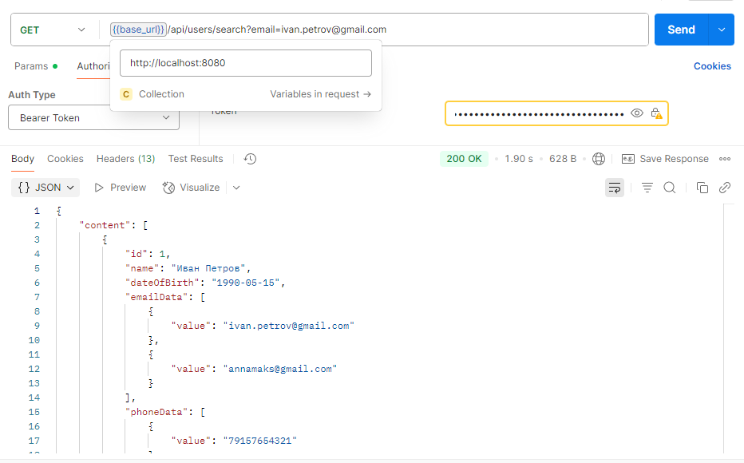
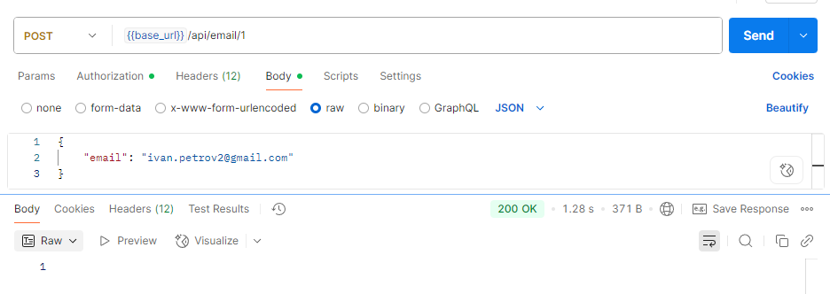

## User Accounting System

### Ссылка на Swagger: http://localhost:8080/swagger-ui.html

Перед началом работы необходимо:
 - запустить файл `docker-compose.yaml` при помощи команды `docker-compose up -d`
 - в файле `application.properties`  указать URL для Docker, который развёрнут у вас (для использования Elasticsearch и Redis):

 - запустить класс `WebApplication` 

База данных была заменена на Н2, потому что не было возможности использовать PostgreSQL (так как и БД, и Docker запущены в рабочей системе)

### Примеры начисления процентов на баланс каждые 30 секунд:
Изначальное начисление:

Достижение лимита по начислению на одном из счетов:

### Примеры запросов через Postman

